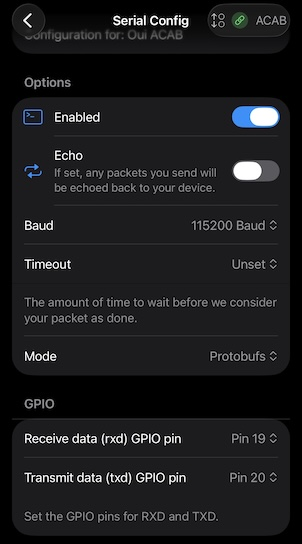

# Mesh-Detect setup (XIAO + Heltec V3)

Mesh-Detect is a **two-board** rig:

- **Seeed XIAO ESP32-S3** runs the ACAB firmware and does the detecting (BLE + WiFi).
- **Heltec V3** runs **Meshtastic** and does the actual LoRa transmitting.

The XIAO sends labelled detections to the Heltec over a wired UART, and the Heltec
puts them on your mesh. Each alert names the unit:

```
Flock camera detected | WiFi | rssi -67 | 70:c9:4e:11:22:33 | 34.05012,-118.24001
Flock Raven detected  | BLE  | rssi -72 | 58:8e:81:aa:bb:cc
Drone detected        | RID  | rssi -61 | RID 1581F4F... | 34.05,-118.24 | alt 120m
Axon body camera detected | BLE | rssi -55 | <mac> | EXPERIMENTAL
```

> The Heltec/Meshtastic side (installing the Meshtastic CLI, the optional
> mesh-mapper web app, screen and Bluetooth options) is written up in the
> companion guide:
> **https://github.com/soyboi1312/meshdetect-macOS/blob/main/macOS.md**.
> This page focuses on the wiring, the channel choice, and the ACAB firmware on
> the XIAO.

## Wiring (XIAO ↔ Heltec)

The XIAO's serial pins are **GPIO5 (TX)** and **GPIO6 (RX)**, matching the Colonel
Panic Mesh-Detect unit's dual-core firmware (the `*-dual-rid` /
`remoteid-mesh-dualcore` source). The Heltec's USB runs through a CP2102 bridge, which
leaves **GPIO19/20** free for its Serial Module. So the pins differ on each side:

| XIAO ESP32-S3 (ACAB firmware) | Heltec V3 (Meshtastic) |
|---|---|
| TX = GPIO5 → | Serial **RXD** = GPIO19 |
| RX = GPIO6 → | Serial **TXD** = GPIO20 |
| GND → | GND |

> The older single-core `remoteid-mesh` firmware uses TX=6/RX=7 instead. If nothing
> arrives, that pin pair is the next thing to try (`uartTxPin`/`uartRxPin` in
> `meshLinkDefaults()`).

## Decide first: public or private channel

This single choice drives both the Heltec's Serial Module mode and how you flash
the XIAO. Get them matched or detections won't come through.

| | **Public** (simplest) | **Private** (your own channel) |
|---|---|---|
| Detections go to | the primary/public channel (anyone on LongFast sees them) | an encrypted secondary channel only your nodes can read |
| Heltec Serial Module mode | `TEXTMSG` | `PROTO` |
| XIAO firmware | default build (web flasher works) | built with `-DACAB_MESH_CHANNEL=<index>` |
| Your node still sees the mesh? | yes | yes (channel 0 is untouched) |

Either way your node stays on the public LongFast mesh and keeps seeing other
nodes. The only difference is whether the detection *messages* are public or
private.

## 1. Configure the Heltec (Meshtastic)

Install the Meshtastic CLI first (Homebrew + pipx), per
[the macOS guide](https://github.com/soyboi1312/meshdetect-macOS/blob/main/macOS.md#1-install-homebrew-pipx-and-the-meshtastic-cli).

### Find the Heltec's port

```bash
ls /dev/cu.usbserial-* /dev/cu.SLAB_* /dev/cu.wchusbserial* 2>/dev/null
```

You'll usually get `/dev/cu.usbserial-0001`. If both boards are plugged in, the
Heltec is the **`usbserial`** (CP2102) port and the XIAO is a **`usbmodem`** port.
When in doubt, unplug the Heltec, run the command, plug it back in, and run it
again. The entry that reappears is the Heltec.

### Region (required) and options

```bash
meshtastic --port /dev/cu.usbserial-0001 --set lora.region US

# optional: fixed BLE pairing PIN (keeps it off the OLED)
meshtastic --port /dev/cu.usbserial-0001 \
  --set bluetooth.mode FIXED_PIN --set bluetooth.fixed_pin 123456

# optional: device name, screen flip
meshtastic --port /dev/cu.usbserial-0001 --set-owner "All Cameras Are Beacons" --set-owner-short "spy"
meshtastic --port /dev/cu.usbserial-0001 --set display.flip_screen true
```

The node reboots after each `--set`, so give it a second between commands.

### Serial Module (match the mode to your channel choice)

**Public (TEXTMSG):**
```bash
meshtastic --port /dev/cu.usbserial-0001 \
  --set serial.enabled true \
  --set serial.baud BAUD_115200 \
  --set serial.mode TEXTMSG \
  --set serial.rxd 19 \
  --set serial.txd 20
```

**Private (PROTO), and add your channel:**
```bash
meshtastic --port /dev/cu.usbserial-0001 \
  --set serial.enabled true \
  --set serial.baud BAUD_115200 \
  --set serial.mode PROTO \
  --set serial.rxd 19 \
  --set serial.txd 20

meshtastic --port /dev/cu.usbserial-0001 --ch-add acab
meshtastic --port /dev/cu.usbserial-0001 --info     # note the "acab" index (usually 1)
```

> `--ch-add` adds a secondary channel and leaves the public channel at index 0
> alone, so your node stays on the LongFast mesh. The index it lands on (usually
> `1`) must match the index you build the XIAO firmware with.

Verify everything with `meshtastic --port /dev/cu.usbserial-0001 --info`.

### Prefer the app? Set the Serial Module there (no command line)

If you would rather not touch the CLI, do the Heltec config in the **Meshtastic
phone app**. Connect to the Heltec, open **Config → Serial**, and match these:



- **Enabled:** on
- **Baud:** 115200
- **Mode:** **Protobufs** for a private channel, **TextMessage** for the public channel
- **Receive data (RXD) GPIO pin:** 19
- **Transmit data (TXD) GPIO pin:** 20

Save and let the node reboot. For a private channel, also add the channel in the
app: **Channels → add a channel** (name it whatever you like, the first one you add
sits at index 1), give it a key, save, then share it with your other nodes (next
section).

### Share the `acab` channel so your nodes can read it (private only)

This is the step people miss. `--ch-add acab` gives the channel a **random
encryption key**, which is the whole point: only nodes that hold that key can read
the detections. But it also means **your own phone and your friends' nodes see
nothing until they have the channel too.** You have to hand it out.

Get the share link (and a QR) off the Heltec:

```bash
meshtastic --port /dev/cu.usbserial-0001 --qr-all
```

That prints a QR plus a `https://meshtastic.org/e/#...` URL carrying your channels,
the `acab` key included.

Add it to each node that should receive detections:

- **Meshtastic phone app (easiest):** open that link, or Settings → **Channels** →
  scan the QR. The app adds the `acab` channel alongside the public one.
- **Another CLI node:** `meshtastic --port <that-node> --seturl "<the URL>"`. Note
  this **replaces** that node's whole channel set, so only use it on a node you are
  setting up fresh.

Send the same link to friends. Anyone without it just stays on the public mesh and
never sees your detections, which is exactly the point.

> Treat the link like a password: anyone who has it can read every detection. To
> rotate it later, `--ch-del` the channel, `--ch-add acab` a fresh one, and
> re-share the new link.

## 2. Flash the XIAO with ACAB

> ### ⚠️ Flash the XIAO, NOT the Heltec
> This is the easiest way to wreck your setup: PlatformIO and the web flasher will
> happily flash ACAB onto whatever board is connected, and ACAB on the Heltec
> wipes Meshtastic (the board goes dark, looks dead). It is recoverable (see
> Troubleshooting), but avoid it:
> - The **Heltec** is the `usbserial-0001` (CP2102, `VID:PID 10C4:EA60`) port. **Do not flash it.**
> - The **XIAO** is a `usbmodem...` (Espressif, `303A:xxxx`) port.
> - Safest move: **unplug the Heltec while you flash the XIAO**, then `pio device list`
>   to confirm only the XIAO's `usbmodem` port is present.

**Public channel** (default firmware):

- Web flasher: **https://soyboi1312.github.io/all-cameras-are-beacons/** → **Flash Mesh-Detect**, or
- ```bash
  pio run -e mesh-detect -t upload --upload-port /dev/cu.usbmodemXXXX
  ```

**Private channel** (index must match the Heltec's `acab` channel):

```bash
PLATFORMIO_BUILD_FLAGS="-DACAB_MESH_CHANNEL=1" \
  pio run -e mesh-detect -t upload --upload-port /dev/cu.usbmodemXXXX
```

A non-zero `ACAB_MESH_CHANNEL` makes the firmware send over PROTO automatically,
matching the Heltec's PROTO mode. Then wire the two boards per the table above and
power both.

## 3. Test it

**Quickest check: the boot self-test ping.** On power-up the firmware sends
`ACAB mesh-detect online` over the configured channel about **10 s after boot**,
before any detection. The fastest end-to-end test is to power the unit, wait ~15 s,
and look for that message on a node listening to your channel. If it lands, the
whole path (XIAO to Heltec to mesh to channel) works. Tap the XIAO's reset button to
re-fire it. (Its `usbmodem` port number can change after a reset; re-run
`ls /dev/cu.usbmodem*` if a tool can't find it.)

**Trigger a real detection** to see the full flow. You need something the XIAO
recognises in range. The most controllable trigger is
a fake Flock BLE signature: on an **Android** phone, **nRF Connect → Advertiser →
Complete Local Name = `Flock`** and start advertising. (The firmware matches the
name substrings `Flock`, `FS Ext Battery`, `Penguin`, `Pigvision`.) A drone with
Remote ID, or a real Flock camera, work too.

Watch the XIAO's USB serial while you trigger it:

```bash
pio device monitor -b 115200 --port /dev/cu.usbmodemXXXX
```

A fresh detection prints two lines:

```
[ACAB] Flock camera   BLE  aa:bb:cc:dd:ee:ff rssi=-58 conf=80
[ACAB-mesh] -> Flock camera detected | BLE | rssi -58 | aa:bb:cc:dd:ee:ff
```

The first line means the detector fired; the second means it pushed the alert to
the Heltec. Then check a node on the target channel for the incoming
`Flock camera detected ...` message.

> Detections are **deduped per device for 60 s** (plus a 3 s floor between sends),
> so you get one message per device, not a stream. To fire again, restart the
> advertiser or wait a minute.

## Troubleshooting

**Browser says "port is already open" / `InvalidStateError`.** Chrome is holding
the serial port from a previous Web Serial attempt. **Quit Chrome entirely
(Cmd+Q)** to release it, then reopen a fresh flasher tab. Only one thing (browser,
`meshtastic` CLI, or serial monitor) can hold the port at a time.

**You flashed ACAB onto the Heltec by accident.** It is not bricked. Re-flash
Meshtastic: **https://flasher.meshtastic.org** → **Heltec V3** → **Full erase and
install**. If Web Serial won't connect, hold the Heltec's **PRG** button, tap
**RST**, release PRG, and retry. Then redo the Meshtastic config from step 1 (the
erase wipes it).

**Boot ping or detection prints in the XIAO serial but nothing reaches the channel.**
The break is on the Heltec side, and it's almost always the serial mode. Work down
this list:

1. **Confirm the XIAO is sending.** Read its USB serial; at boot it logs its config,
   e.g. `[ACAB-mesh] uplink PROTO, channel 1, 115200 baud (RX=6 TX=5)`, and
   `[ACAB-mesh] -> …` each time it transmits. If you see those, the XIAO is fine and
   the fault is downstream.
2. **Check the Heltec's serial mode (the usual culprit).** A private channel needs
   **PROTO**; left on `TEXTMSG`, the Heltec silently drops every protobuf frame.
   ```bash
   meshtastic --port /dev/cu.usbserial-0001 --get serial.mode    # PROTO = 2, TEXTMSG = 1
   meshtastic --port /dev/cu.usbserial-0001 --set serial.mode PROTO
   ```
   The pairing must match: public = TEXTMSG + channel 0; private = PROTO + channel N.
3. **Check the channel index.** `meshtastic --port … --info` should show your `acab`
   channel at the same index you built with (`-DACAB_MESH_CHANNEL=N`).
4. **Check the wiring + ground.** XIAO TX (GPIO5) must reach Heltec RXD (GPIO19), and
   GND must be shared, or nothing arrives even when the XIAO is sending.

## Protobuf frame (PROTO mode reference)

The PROTO transport emits, per detection:

```
94 C3 <len_hi> <len_lo>                         stream frame header
  0A <mp_len>                                   ToRadio.packet (field 1)
    15 FF FF FF FF                              MeshPacket.to = 0xFFFFFFFF (field 2, fixed32)
    18 <channel>                                MeshPacket.channel (field 3, uint32)
    22 <data_len>                               MeshPacket.decoded (field 4)
      08 01                                     Data.portnum = TEXT_MESSAGE_APP (field 1)
      12 <text_len> <utf8 text…>                Data.payload (field 2)
```

Field numbers verified against
[meshtastic/mesh.proto](https://github.com/meshtastic/protobufs/blob/master/meshtastic/mesh.proto).

## Rate limiting

To respect the LoRa duty cycle, the firmware sends **only on a new sighting** (per
the 60 s dedup window) and enforces a **3 s floor** between mesh transmits
(`MeshLinkConfig.minIntervalMs`). Tune for your region's regulations and channel
utilisation.
